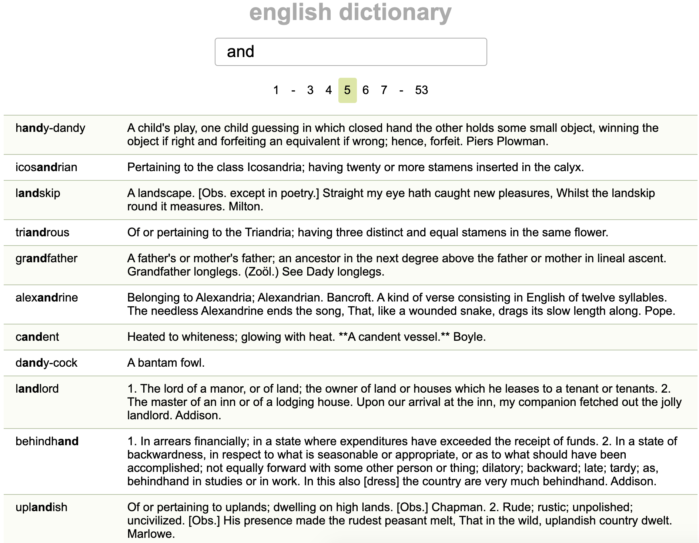

### English dictionary

This project is an experiment trying to paginate big amounts of data.

**Made with Node.js and Vue.js**

To setup the project:
```js
npm install
```
To start the server:
```js
npm run serve
```
The server will run on `localhost:3000`

Screenshot:

